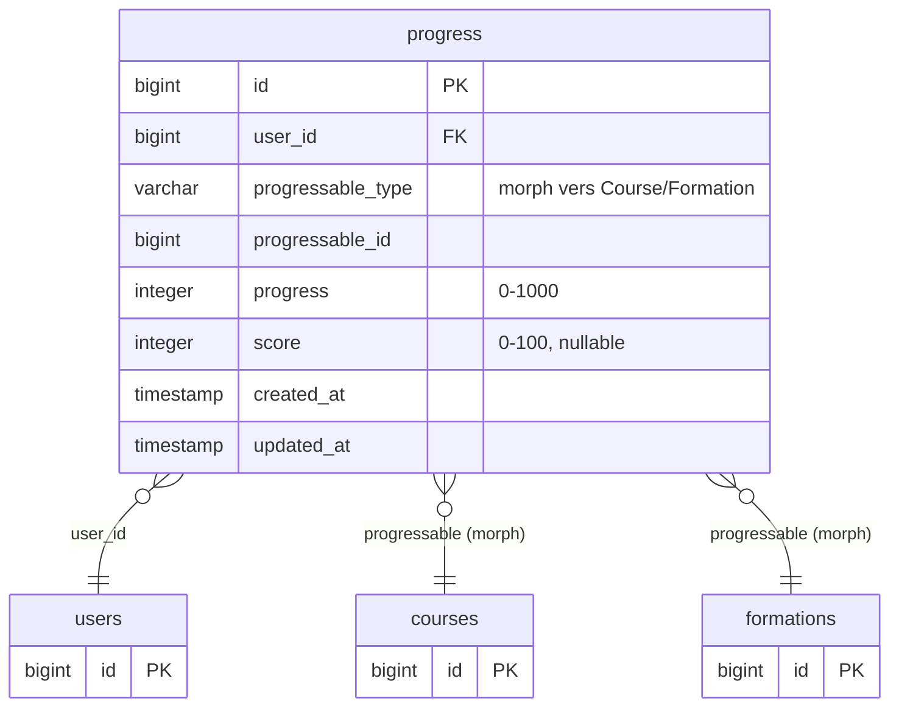
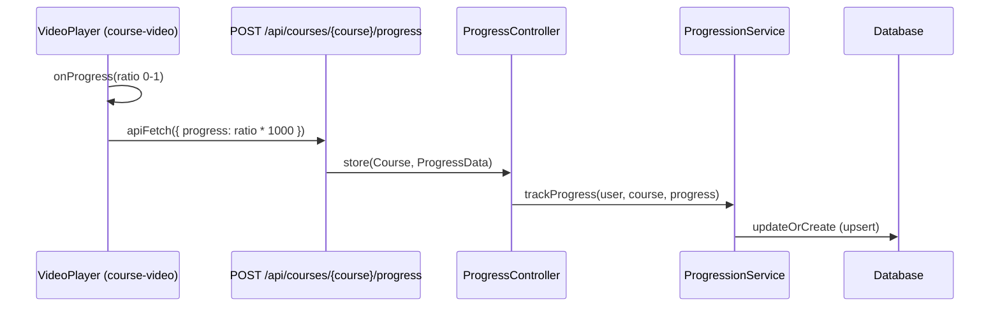
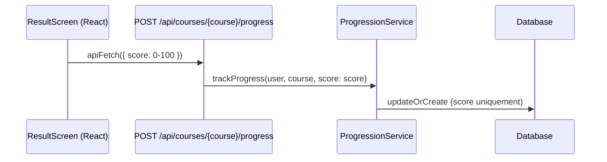
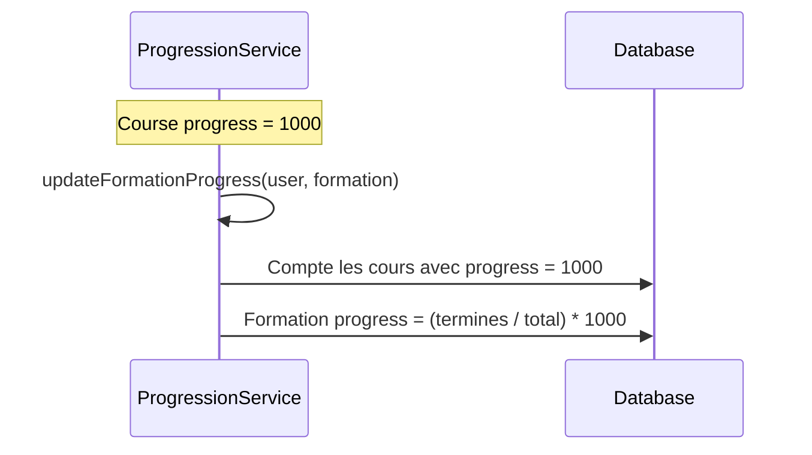

# Domain History

Suivi de la progression des utilisateurs a travers les cours et les formations.

## Schema BDD

La table `progress` utilise une relation polymorphique pour suivre la progression sur un `Course` ou une `Formation`. La progression est stockée sur une echelle de 0 a 1000 (0 = pas commence, 1000 = termine). Le champ `score` est optionnel et sert a enregistrer les resultats de quiz.

Une contrainte d'unicité sur `[user_id, progressable_id, progressable_type]` garantit un seul enregistrement de progression par utilisateur et par contenu.

## Suivi de progression video

Lorsqu'un utilisateur regarde une video, le custom element `course-video` envoie periodiquement la progression de lecture a l'API. La valeur est convertie d'une echelle 0-1 (ratio video) vers 0-1000 (echelle BDD).

## Suivi de score (quiz)

Apres un quiz, le composant `ResultScreen` envoie le score (0-100) à la meme API. Le score est enregistré independamment de la progression video.

## Cascade vers les formations

Quand un cours atteint `progress = 1000` (termine), le `ProgressionService` recalcule automatiquement la progression de la formation parente. Le ratio est basé sur le nombre de cours terminés par rapport au total de cours dans la formation.

## Reprise de lecture

La methode `Course::startTimeForUser()` permet de reprendre une video la ou l'utilisateur s'était arrêté. Elle récupère le ratio de progression et le convertit en secondes : `ratio * duree_du_cours`.

## Validation (ProgressData)

L'API valide les données entrantes via le DTO `ProgressData` :

- `progress` : nullable, entier, entre 0 et 1000
- `score` : nullable, entier, entre 0 et 100
