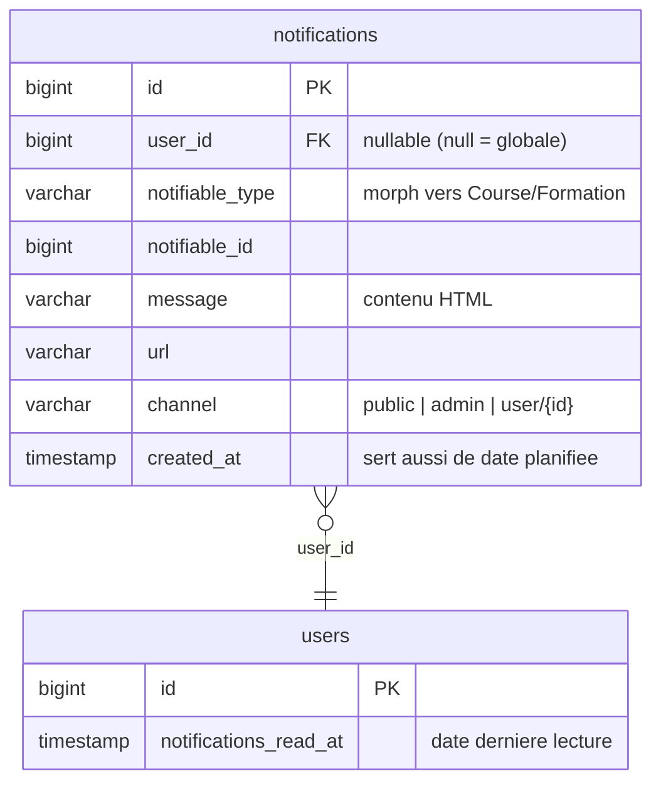
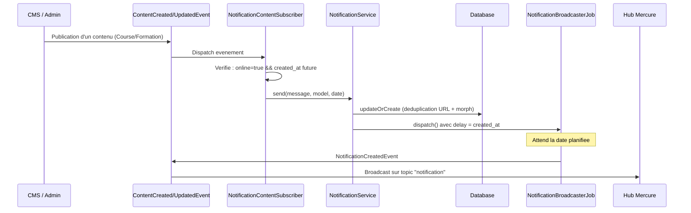
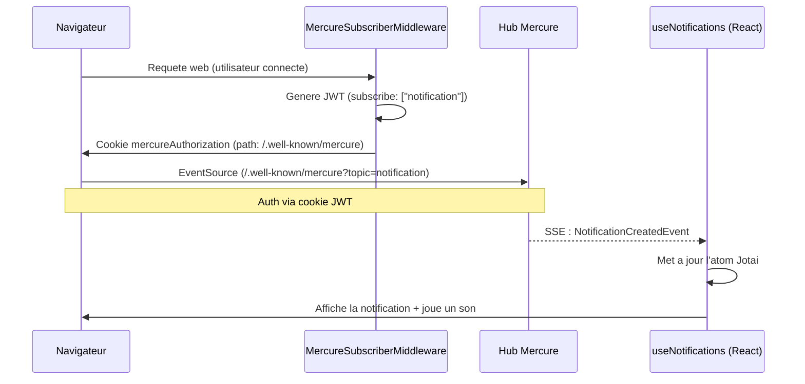
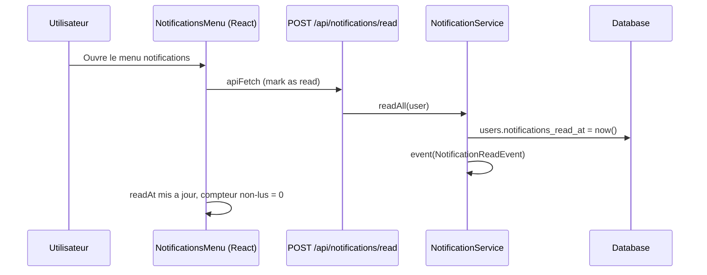
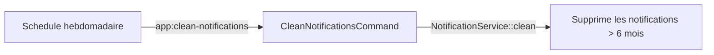

# Domain Notification

Gestion des notifications en temps reel pour les utilisateurs du site.

## Schema BDD

Une notification peut etre globale (`user_id = null`, visible par tous) ou ciblee vers un utilisateur specifique. Le champ `created_at` sert aussi de date de publication planifiee : une notification avec une date future ne sera ni visible ni broadcastee avant cette date.

## Flux de creation

Quand un contenu (Course ou Formation) est publie avec une date future, le `NotificationContentSubscriber` detecte le changement et delegue au `NotificationService`. Celui-ci cree la notification en BDD (avec deduplication via `updateOrCreate`) puis dispatche un job en queue avec un delai correspondant a la date de publication. A l'echeance, le job broadcast l'evenement vers Mercure.

## Temps reel (Mercure)

Le `MercureSubscriberMiddleware` genere un JWT signe avec le `subscriberSecret` et le place dans un cookie `mercureAuthorization` scope sur le path `/.well-known/mercure`. Le navigateur utilise ce cookie pour authentifier l'`EventSource` SSE aupres du hub Mercure. Cote React, le hook `useNotifications` met a jour un atom Jotai a chaque evenement recu et joue un son de notification si la fenetre est active.

## Lecture

Lorsque l'utilisateur ouvre le menu de notifications, le frontend appelle `POST /api/notifications/read`. Le `NotificationService` enregistre la date de lecture dans `users.notifications_read_at`. Le compteur de non-lus est calcule cote client en comparant la date de chaque notification a ce `readAt`.

## Nettoyage

La commande `app:clean-notifications` est planifiee de facon hebdomadaire et supprime toutes les notifications de plus de 6 mois afin d'eviter l'accumulation de donnees obsoletes.

## Scope `forUser`

Le scope `forUser` centralise la logique de visibilite des notifications pour un utilisateur donne. Il exclut les notifications planifiees dans le futur, ne retient que le channel `public`, et combine les notifications globales (`user_id IS NULL`) avec celles ciblees vers l'utilisateur.

- `created_at <= now()` (pas de notifications futures)
- `channel = 'public'`
- `user_id IS NULL` (globale) OU `user_id = user.id` (ciblee)
