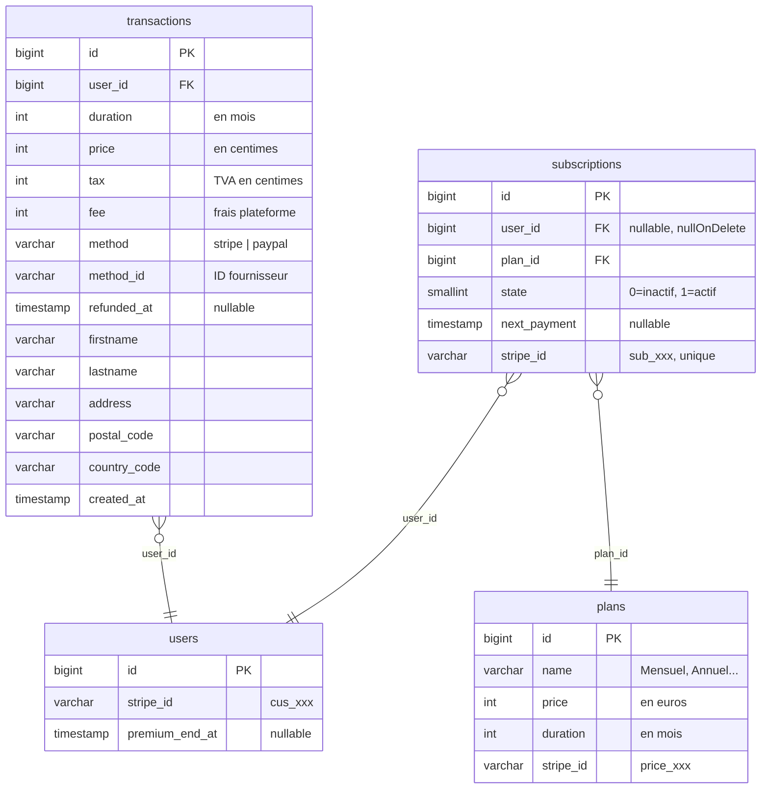
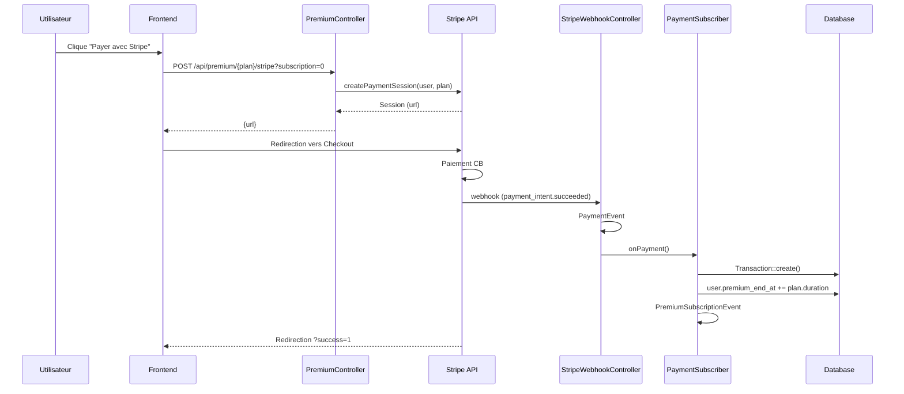
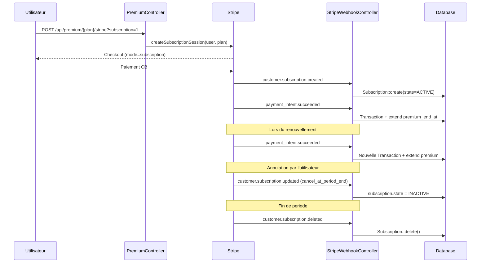
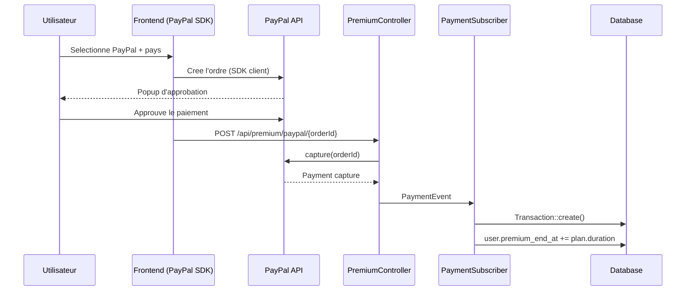
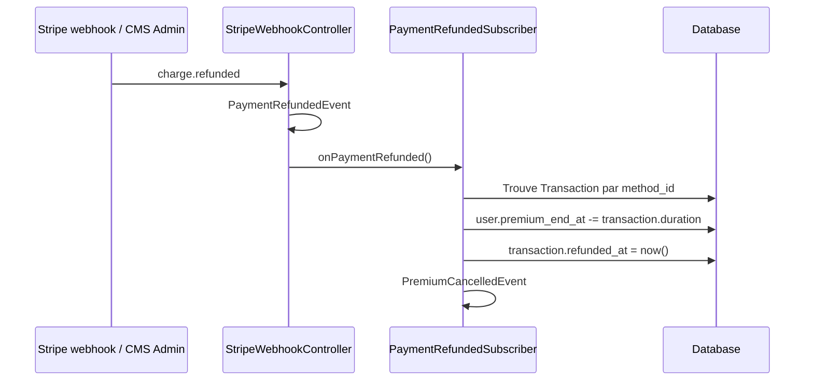
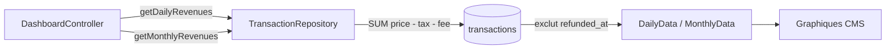
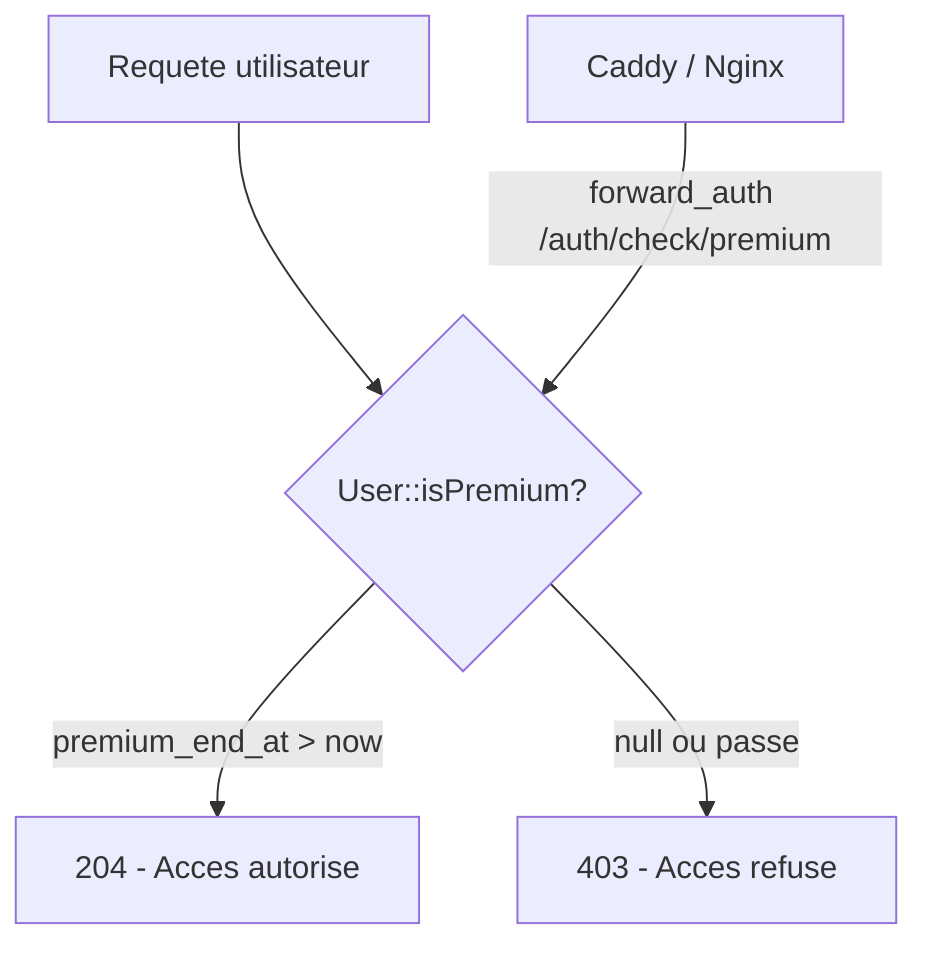

# Domain Premium

Gestion de l'abonnement premium, des paiements (Stripe et PayPal) et du suivi des transactions.

## Schema BDD

Le systeme repose sur trois tables. 

- Les `plans` definissent les formules d'abonnement (prix, duree).
- Les `transactions` enregistrent chaque paiement effectue.
- Les `subscriptions` suivent les abonnements Stripe recurrents. 

L'état premium de l'utilisateur est stocké directement sur le modele `User` via `premium_end_at`, ce qui permet d'empiler les durées en cas de renouvellement anticipé.

## Paiement unique (Stripe)

L'utilisateur choisit un plan et clique sur le bouton Stripe. Le frontend envoie une requete au `PremiumController` qui cree une session Checkout et renvoie l'URL de redirection. Apres paiement, Stripe envoie un webhook qui declenche la chaine de creation de transaction et d'extension du premium.

## Abonnement recurrent (Stripe)

Le flux est similaire au paiement unique, mais utilise le mode `subscription` de Checkout. Stripe envoie des webhooks supplémentaires pour gerer le cycle de vie de l'abonnement (creation, mise à jour, suppression). À chaque renouvellement, un `payment_intent.succeeded` déclenche une nouvelle transaction.

## Paiement PayPal

Pour PayPal, le paiement est initie cote client via le SDK PayPal. L'utilisateur choisit son pays (pour le calcul de TVA : 20% France, 0% ailleurs) puis valide dans la popup PayPal. Le frontend envoie ensuite l'`orderId` au backend qui capture le paiement et dispatche le meme `PaymentEvent` que Stripe.

## Remboursement

Le remboursement peut etre declenche depuis le CMS (marquage manuel) ou automatiquement via un webhook Stripe (`charge.refunded`). Dans les deux cas, le `PaymentRefundedSubscriber` retrouve la transaction, soustrait la durée du premium de l'utilisateur et marque la transaction comme remboursée.

## Graphiques du CMS (revenus)

Le `TransactionRepository` fournit les donnees agregees pour le dashboard CMS. Il calcule le revenu net (`price - tax - fee`) en excluant les transactions remboursees, avec deux granularites : journaliere (30 derniers jours) et mensuelle (24 derniers mois).

## Vérification du statut premium

Le statut premium est vérifié via `User::isPremium()` qui compare `premium_end_at` a la date courante. Une route dédiée (`/auth/check/premium`) permet à un reversé proxy (Caddy/Nginx) de verifier le statut via `forward_auth` ou `auth_request`.

